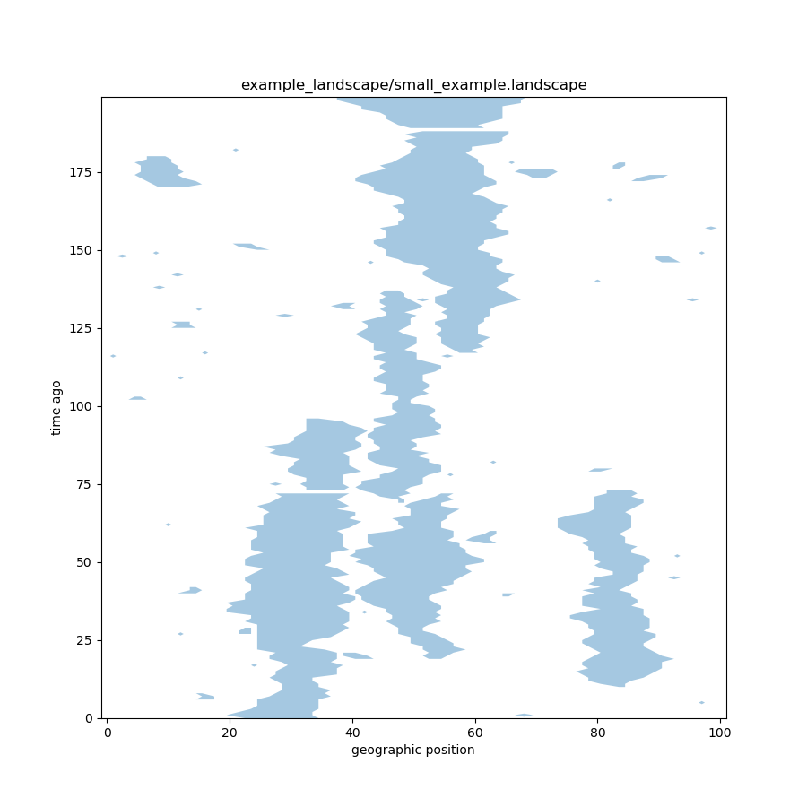
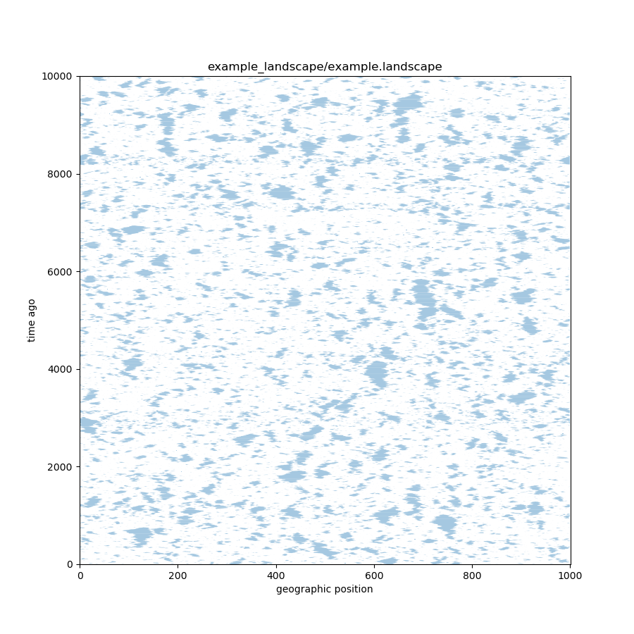
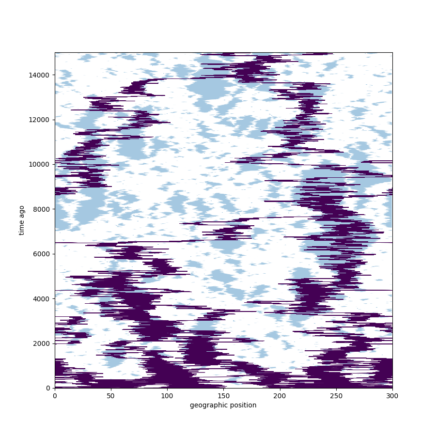
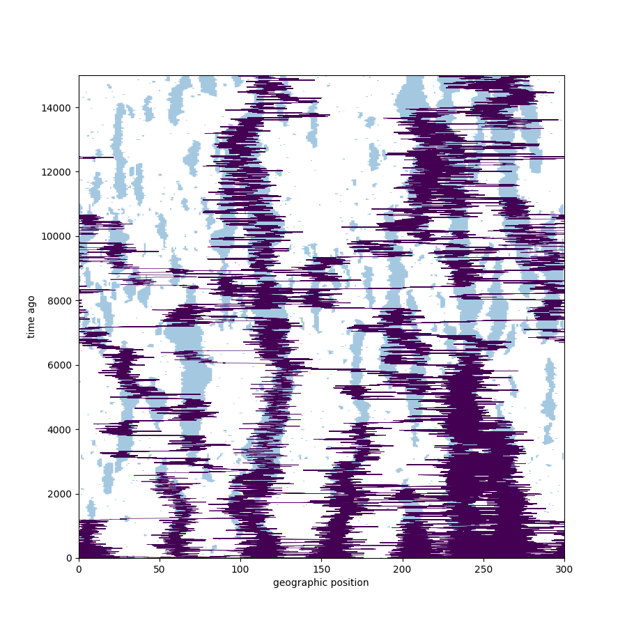
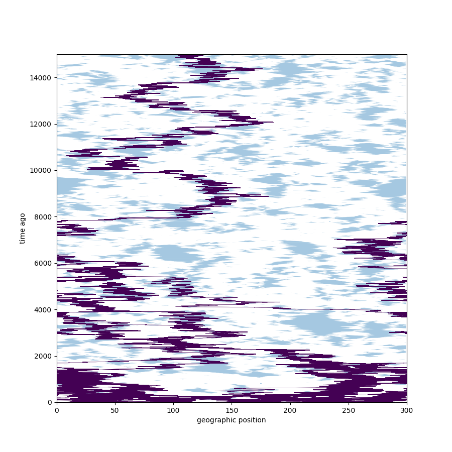

# What's a lineage?

##

The *lineage* of a particular gene
is the path
$$
    t \mapsto L(t),
$$
where $L(t)$ is

- the ancestor from time $t$ ago that the gene was inherited from, or maybe
- the *location* of that ancestor in space.

##

Suppose in a population of annual plants,
at time $t$ ago

- there are $N_x(t)$ individuals at location $x$,
- that each produce $\lambda(x)$ seeds (and die),
- and each seed moves to $y$ with probability $m_{xy}$,
- surviving with probability $s(y)$.

. . .

Then
$$\begin{aligned}
    N_y(t-1)
    = \sum_x N_x(t) \lambda(x) m_{xy} s(y) ,
\end{aligned}$$

. . .

and if $L(t) = y$ then
$$\begin{aligned}
    \P\{L(t+1) = x\}
    =
    \frac{ N_x(t+1) \lambda(x) m_{xy} }
        { \sum_z N_z(t+1) \lambda(z) m_{zy} } .
\end{aligned}$$

## Example:

Let $N_x(t) = N$ for $x \in \mathbb{Z}$, $t \ge 0$
and $m_{xy} = m(|y-x|)$ with
$$\begin{aligned}
    \sum_x x m(x) &= 0 \\
    \sum_x x^2 m(x) &= \sigma^2 .
\end{aligned}$$

Then $\E[L(t)^2] = t \sigma^2$, and
$L(t/\epsilon) / \sqrt{\epsilon}$ converges to a Brownian motion.

## More general observations:

1. Times between lineage jumps are drawn from the *generation time*,
    i.e., the typical age of parent at time of birth of child.

2. Lineages move towards areas of greater offspring production.

# Questions

## What do lineages tell us?

*Basic observation:*
"$L(0) = y$ and $L(t) = x$"
means that the genome at $x$ was the parent of that at $y$.

. . . 

and so
$$\begin{aligned}
    \P\{ L(t) = x \}
    &=
    \text{( proportion of genomes today at $y$ } \\
    &\qquad \text{ descended from those that were at $x$ )}
\end{aligned}$$

## How fast do genes spread?

Suppose a mutation occurred $t$ ago at $x$.
It's density today is
$$\begin{aligned}
    \propto \frac{\P^x\{ L(t) = y \}}{N(x)}
\end{aligned}$$

. . .

In the example, $\sim \sigma \sqrt{t}$.

## Where's the long-term fitness?

If $L$ has stationary distribution $\pi$ then
$$\begin{aligned}
    \frac{\pi(x)}{N(x)}
    \propto
    \text{( mean fitness at $x$ )} .
\end{aligned}$$

# Thinking backwards

## Effective dispersal

**Question:** What is
$$\begin{aligned}
    \lim_{t \to \infty} \frac{\E[L(t)^2]}{ t } := \sigma^2_e 
\end{aligned}$$

. . .

In general,
$$\begin{aligned}
    \sigma^2_e \neq \sigma^2 .
\end{aligned}$$

## Stable patches

Suppose there are two types of habitat: for $x \in \mathbb{Z}$:
$$\begin{aligned}
   x \text{ even } \longrightarrow \text{good, $N(x)$ big} \\
   x \text{ odd } \longrightarrow \text{good, $N(x)$ small} .
\end{aligned}$$

. . .

Most odd-distance migrants die, so
$$
\sigma^2_e \approx 
    \frac{
        \sum_{x \ge 1} (2x)^2 m(2x)
        }{
        \sum_{x \ge 1} m(2x)
        }
        < \sigma^2, \quad \text{ usually.}
$$

## Negative correlations

Now suppose the patches *turn over*, so
$$\begin{aligned}
   t + x \text{ even } \longrightarrow \text{good, $N(x)$ big} \\
   t + x \text{ odd } \longrightarrow \text{good, $N(x)$ small} .
\end{aligned}$$

. . .

Most *even*-distance migrants die, so
$$
\sigma^2_e \approx 
    \frac{
        \sum_{x \ge 1} (2x + 1)^2 m(2x + 1)
        }{
        \sum_{x \ge 1} m(2x + 1)
        }
        > \sigma^2, \quad \text{ usually.}
$$

# Life in a big-small world

##

::: {.columns}
::::::: {.column width=50%}

Consider a dynamic 1d landscape of "good patches"
with stationary distribution
$$\begin{aligned}
    \P\{N(x+1) = \text{big}|N(x) = \text{small}\} &= p_\text{good} \\
    \P\{N(x+1) = \text{small}|N(x) = \text{big}\} &= p_\text{bad} ,
\end{aligned}$$
where patches move in a *reversible* way by:

1. jittering their edges,
2. appearing in bad areas,
3. and disappearing when small.
4. (No merging/splitting, though.)

:::
::::::: {.column width=50%}

{width=70%}

:::
::::::

##

{width=70%}

## 

{width=70%}

##

{width=70%}

##

{width=70%}

##

{width=70%}

##

$\sigma_e$ is determined by

1. dispersal variance ($\sigma^2$),
2. cluster movement ($\gamma_m$), and
3. how long lineages are trapped in clusters ($\gamma_b$).

## Questions

How will patch dynamics affect lineage movement,
in particular, $\sigma_e$?

1. $\sigma_e$ should increase with *patch jitter*, $\gamma_m$, and
2. increase with *patch birth/death*, $\gamma_b$.

. . .

*Note:* the landscape at each point in time has the *same* characteristics.
How much will its temporal dyanmics change gene flow?

# SLiMulation

## Overview of the "experiment"

A population living in continuous space
with local discrete-time dynamics:

- *Reproduction:* everyone produces
    Poisson($f$) offspring
    with a random mate chosen from a Gaussian(1) kernel
    (or, by selfing)

- with $f = 1.25$ in "bad" habitat and $f=2.25$ in "good".

- *Dispersal:* Gaussian(6)

- *Establishment:* with probability
$$ \frac{1}{1 + C \times \text{( local density )}} $$,

- *Mortality:* constant probability $1/4$ of death.

##

- Record locations of everyone alive ever,
- and how they inherited chromosomes from their parents
- in a *tree sequence*; parsed using tskit and pyslim.

Width 1,000 neighborhood, burn-in of 1,000 time steps,
run for 5,000 time steps:
$\sim$ 5,000 individuals alive.

## 

(see SLiM)

## Computing  $\sigma^2_e$:

Extract the *relatedness matrix:*
$$
P_{ij} = 1/2 \quad \text{if $i$ is a parent to $j$},
$$
and
$$\begin{aligned}
    x_i &= \text{( location of individual $i$ )} \\
    t_i &= \text{( birth time ago of individual $i$ )}
\end{aligned}$$

. . .

So:
$$\begin{aligned}
    x^T P^n \delta_i
\end{aligned}$$
is the mean location of $n^\text{th}$-generation ancestors
of individual $i$.

##

Let $L_n$ be the location of a random $n$th generation ancestor,
and $T_n$ be the time since their birth.
Then if $z_i = x_i^2 / t_i$,
$$\begin{aligned}
    \E^i\left[\frac{(L_n - L_0)^2}{T_n - T_0}\right]
    = z^T P^n \delta_i .
\end{aligned}$$
